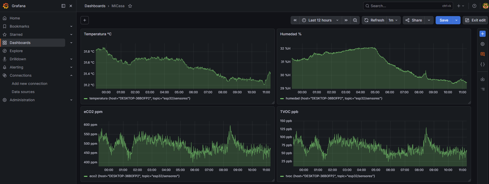

# 5. Visualización (Grafana Dashboards)

Este módulo describe la capa de presentación de datos, donde las métricas ambientales se transforman en información visual útil para la toma de decisiones.

## 📊 Elementos del Dashboard

El tablero de control ha sido diseñado para ofrecer una visión 360º de la calidad del aire en tiempo real:

1. **Monitor de Gases:** Visualización de `eCO2` (ppm) y `TVOC` (ppb) mediante indicadores tipo *Gauge*.
2. **Histórico Ambiental:** Gráficas de evolución temporal de `Temperatura` (°C) y `Humedad` (%).
3. **Semáforo AQI:** Panel de estado que refleja el Índice de Calidad del Aire según el estándar UBA.

---

## 📸 Captura del Sistema en Funcionamiento

Aquí se muestra la interfaz final del centro de control desplegado:

> *Nota: Si la imagen no carga, asegúrese de que el archivo 'dashboard_grafana.png' esté presente en la misma carpeta que este archivo README.*

---

## 🚀 Configuración de Grafana

El servidor de visualización corre en el puerto `3000`. Se ha establecido una conexión robusta con el almacenamiento persistente para garantizar la disponibilidad de los datos.

### Conexión con InfluxDB v2 (Flux)
Para integrar los datos, se creó un **Data Source** con la siguiente configuración:

* **Query Language:** Flux
* **URL:** `http://localhost:8086`
* **Auth:** Token-based (API Token de InfluxDB)
* **Bucket Predeterminado:** `sensores`

## 🛠️ Cómo Replicar el Panel
1. Acceda a Grafana (`http://localhost:3000`).
2. Asegúrese de que el Data Source de InfluxDB devuelva un "Green Status" en el test de conexión.
3. Cree un nuevo Panel y utilice consultas Flux para extraer los datos del bucket.
